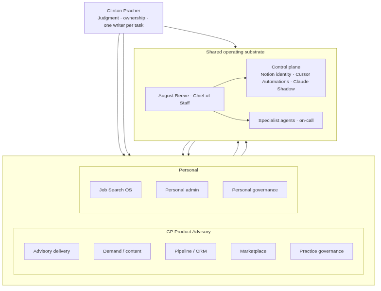

# Work — AI Systems Portfolio

I build decision systems — not just products. These case studies show how I apply the same operating logic at enterprise scale (13-product AI portfolio, 100+ markets) and solo-operator scale (65 skills, 28 automations, one Chief of Staff agent).

**Portfolio narrative:** I don't collect AI tools. I built an Operator Control Plane.

---

## Case studies

### [Operator Control Plane](control-plane.md)

The ownership layer that assigns write authority across models, tools, and schedules. One Active Writer per task. Identity, execution, and audit separated.

**Best for:** AI platform, data product, transformation roles

---

### [Job Search OS](job-search-os.md)

A governed decision system applied to my own career search — 0-9 scoring rubric, Role Radar intake, LinkedIn-first discovery, 6-application weekly cap.

**Best for:** Product ops, transformation, platform governance roles

---

### [Automation Fleet](automation-fleet.md)

28 Cursor automations with Active Writer governance and fleet-health self-healing. Six waves of cutover with explicit ownership transfer.

**Best for:** Platform ops, AI infrastructure, product operations

---

### [Governance Audit Cycle](governance-audit.md)

Three-night certification: Read-Only audit → approved remediation → post-fix verification.

**Best for:** Enterprise governance, compliance-adjacent platform roles

---

## Thought leadership

- [Operator Control Plane essay](https://cpproductadvisory.com/blog/operator-control-plane)
- [Writing index](../writing/README.md)
- [Clint's Call (Substack)](https://clintscall.substack.com)

---

[← Back to home](../README.md)
